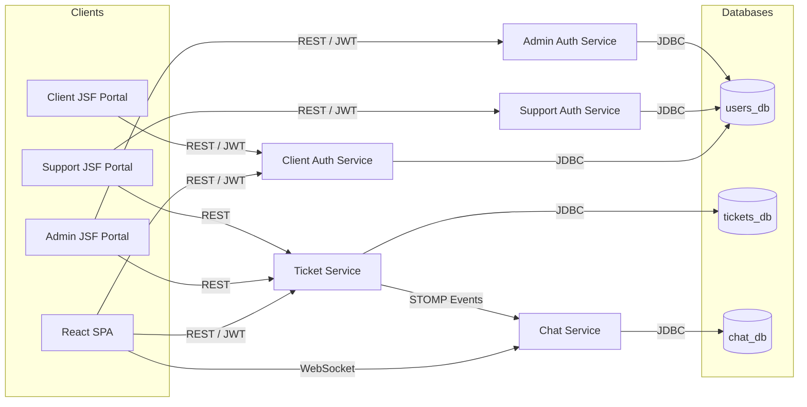

# ComplaintService Platform

ComplaintService is a multi-module helpdesk platform that blends customer self-service, support operations, and real-time collaboration. The repository aggregates Spring Boot microservices, JavaServer Faces (JSF) back-office applications, and a React single-page application to deliver an end-to-end ticketing experience.

## Repository layout

| Module | Type | Purpose |
| --- | --- | --- |
| `chat-service` | Spring Boot (3.2) | Hosts the WebSocket gateway, relays ticket assignment events, and orchestrates voice/video calls via `ChatController`. |
| `ticket-service` | Spring Boot (2.7) | Provides REST APIs for ticket CRUD, publishes STOMP topics, and enforces role-based access through JWT filters. |
| `auth` | Spring Boot (2.7) | Manages client registration, login, and profile lifecycle through the `AuthController` endpoints. |
| `auth-support` | Spring Boot (2.7) | Supplies authentication and credential management for support agents, mirroring the flows exposed to clients. |
| `admin-auth` | Spring Boot (2.7) | Offers administrator login, profile management, and provisioning utilities with input validation. |
| `frontend` | React + Tailwind | User-facing SPA that consumes the REST APIs, subscribes to ticket events over STOMP, and launches chat sessions. |
| `Admin`, `Support`, `jsflogin` | JSF web apps | Role-specific portals backed by CDI-managed beans that call the Spring services and propagate JWT tokens. |
| `AdmintEst` | Legacy JSF stub | Historical experimentation module retained for completeness and regression comparison. |

The Maven root POM coordinates shared dependency versions, module builds, and plugin configuration across the Java projects.

## Technology stack

- **Backend services:** Spring Boot 2.7/3.2, Spring Web, Spring Security, Spring Data JPA, Spring WebSocket.
- **Frontend:** React 19 with Tailwind CSS, React Router, Axios, and SockJS/STOMP integration.
- **Presentation (back-office):** Jakarta EE / JSF with CDI-managed beans and JAX-RS clients.
- **Database:** MySQL schemas that store identities, tickets, and chat transcripts (one schema per domain service).
- **Messaging:** STOMP topics bridge ticket events from the REST APIs to the chat gateway.

## End-to-end architecture

The diagram below summarises how requests flow through the platform and where state is persisted.



## Prerequisites

- Java 17+ (required for the Spring Boot 3.2 chat-service; the 2.7 services remain compatible).
- Maven 3.9+
- Node.js 18+ and pnpm/npm/yarn for the React client.
- MySQL 8 with databases:
  - `users_db`
  - `tickets_db`
  - `chat_db`
- (Optional) A TLS keystore (`keystore.p12`, alias `ysn`, password `ysn123`) if you plan to expose HTTPS locally.

## Configuration

1. **Database credentials** – Update the `spring.datasource.*` keys inside each service to match your local MySQL instance.
2. **Ports** – Default assignments are: Auth (`8090`), Support Auth (`8091`), Admin Auth (`8092`), Ticket Service (`8093`), Chat Service (`8082`). Adjust the `server.port` value per module if these ports clash with existing processes.
3. **Cross-origin & target URLs** – The JSF portals are preconfigured for production domains (`*.prjsdr.xyz`). Update their REST client targets if deploying elsewhere.

## Build & run

### Backend microservices

```bash
# From the repository root
mvn clean install

# Start individual services
tab 1: cd auth && mvn spring-boot:run
tab 2: cd auth-support && mvn spring-boot:run
tab 3: cd admin-auth && mvn spring-boot:run
tab 4: cd ticket-service && mvn spring-boot:run
tab 5: cd chat-service && mvn spring-boot:run
```

Spring Boot DevTools hot reload works out of the box when running via Maven. The services issue and validate JWTs to protect REST and WebSocket channels.

### React frontend

```bash
cd frontend
pnpm install   # or npm install / yarn install
pnpm start     # HTTPS dev server on https://localhost:3000
```

The SPA subscribes to `/topic/tickets/created` broadcasts and can initiate live chat sessions through the chat-service once a support agent accepts the ticket.

### JSF portals

Each JSF module (`Admin`, `Support`, `jsflogin`) is a standalone WAR. Build and deploy on a Jakarta EE 9+ compatible container such as Payara or WildFly:

```bash
cd Admin && mvn clean package
# Deploy target/Admin.war (or the equivalent module WAR) to your application server
```

The managed beans encapsulate REST client calls to the Spring APIs, propagating JWT tokens obtained during login.

## Operational notes

- Ticket creation events immediately notify connected support agents via WebSocket to shorten response times.
- JWT claims (user id & role) govern access to ticket data, ensuring clients only see their own tickets while staff view assigned queues.
- All services log at DEBUG level by default; tune logging in the `application.properties` files for production.

## Contributing

1. Fork the repository and create a feature branch.
2. Follow the established code style per module (Spring Boot / JSF conventions).
3. Submit a PR describing the scope, tests, and any configuration changes.

## License

This project currently does not declare a license. Please ensure you have permission before redistributing or deploying it.
